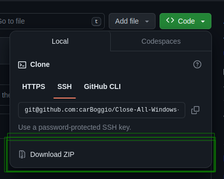

# Close-All-Windows-in-linux


## Stepps to use it:

(Works only in linux)

---

## 1) Install `wmctrl` with the next lines:

- The program need it
- just copy and paste this to do it:

```jsx
sudo apt-get update
sudo apt-get install wmctrl
```

## 2) clone the repo or dowload the file:

- Just clone the repo with this comands:

```bash
git clone git@github.com:carBoggio/Close-All-Windows-in-linux.git
```

`or`

```bash
git clone https://github.com/carBoggio/Close-All-Windows-in-linux.git
```

`or download:`



## 3) Go to the folder **`Close-All-Windows-in-linux` That you download or clone**

- open in the console:


## 4) Give to `closeWindows.sh` execute permissions

```bash
chmod +x closeWindows.sh
```

## 5) For execute the program:

just write in terminal in **`Close-All-Windows-in-linux` folder:**

- and it will execute

```bash
./closeWindows.sh
```

## 6) To make a easy execution:

<aside>
💡 You can make that the program execute with a shortcut, by press a key
Thats how you can do it:

</aside>

1. Just  go to `settings` and serch for `keyboard`:


2. At the end of the `page` go to `view and Customize Shortcuts`
    

    

3. At the end go to `Custom Shortcuts`


4. Add 1 shortcut:


5. Copy the direction to **`Close-All-Windows-in-linux` folder**


6. In the input that says `command` put:
    
    
    
    ```bash
    sh -c "<path-to-the-file>/closeWindows.sh"
    #Exp:
    sh -c "~/proyects/closeAllWindows/closeWindows.sh"
    ```
    
7. Then in the `Name` put the name put the name of your preference i put `closeAllWindows`
    - You can put what you want


8. Then go to `Shortcut` and set the shortcut
    
    
    
    - Press <`ctrl or shift or alt`> + <`Other letter` `or numeber`>
    - `Exp:` I use <`Ctrl`> + <`0`>
    
9. Onece you have all set it `close all` and `try to do it` 


